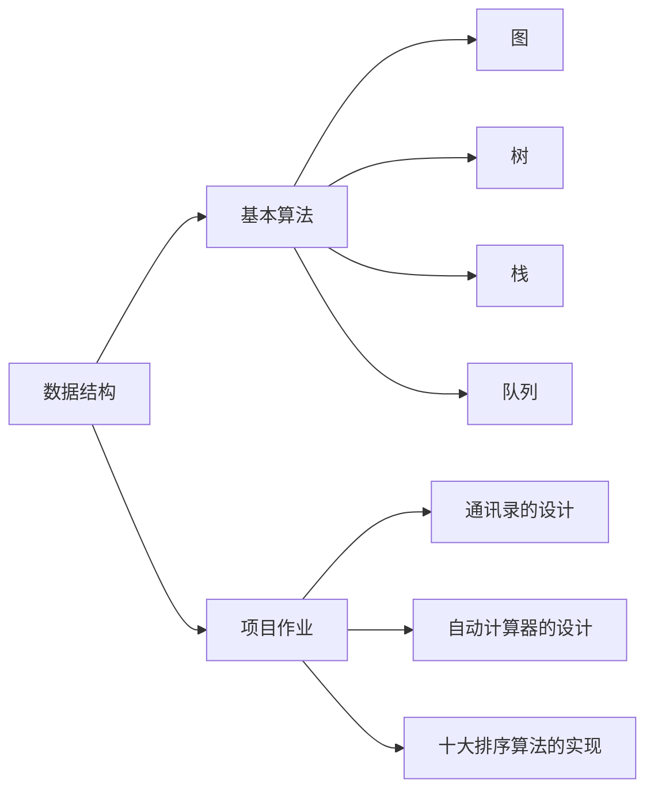

# Data-Strcuctures
update some structures algorithm

```mermaid
	graph LR
	a[数据结构]-->A
	a-->A1[项目作业]
	A[基本算法]-->B[图]
	A-->C[树]
	A-->D[栈]
	A-->E[队列]
	A1-->B1[通讯录的设计]
	A1-->C1[自动计算器的设计]
	A1-->D1[十大排序算法的实现]
	
```

