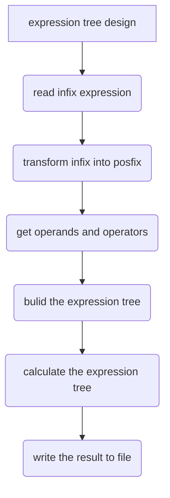

# Tree Comprehensive Experiment Report  

Class: 网络181&emsp;  Student ID 1:18401190120&emsp;Name 1: 曹鹏霄                           
Experiment Date:2019年11月30日


### One、	Experimental purpose
1、Do linear list operations by using basic operations of tree or binary tree.

2、Handle file operations.

3、Deep the understanding of tree and binary tree, gradually develop the programming ability to solve practical problems.

### Two、Experimental environment
A computer with visual studio 2019.

This experiment has 4 class hours in all.

### Three、Experimental content

<font size=4>design a "automatic calculator" as follows：</font>

>（1）The expression that needs to be calculated is stored in the text file in the TXT text；
>
>（2）Each line in the text is an expression；
>
>（3）Expressions include operands, operators such as addition, subtraction, multiplication and 		division, and parentheses；
>
>   For example： （34-72.3) * 54.7-82.4 
>
>（4）"Automatic calculator" calculates each expression in the text file according to the input file name, and writes every expression of the result to the original file name in the _out.txt, you should use the method of covering and when saving the records. The format of each row is：
>
>  expression = result。
>
>   For example：the original file is: A1.txt
>
>​      The file for output is： A1_out.txt
>
>​      The format of the text in A1_out.txt is（34-72.3)*54.7-82.4 = -2177.41
>
>​	  For all the calculated results, you'd keep 4 digits after the decimal point if it is decimal.
>
>   （5）Generate a statistical document after the calculation, its content is：
>
>	Execution time：xxxx-xx-xx hh:mm:ss
>	The total number of expressions is：XXX
>  	The number of correct expressions is：XXX
>	The number of error expressions is：XXX
>   	Naming rules for filenames：original file name :_log.txt，Write files with append write method。
>	For example：A1.txt corresponding to the statistical file：A1_log.txt*
>  
>**Special remind**：★The calculation process requires transform the infix expression to the postfix expression and then transform the postfix expression to expression tree. Finally get the result by calculating the expressions.
> 
>(If you are getting into trouble in calculating decimal, you can only consider integer calculation.)

### Four、Important data structures
__Struct introduce:__

```c
class Tree {
	private:
		string postExp;// postfix expression 
		string Node[N];//expression tree
		int tLen;//record the expression length 
		string tempExp[N];//Operands and operators string 
		void BuildTree(int,int,string tExp[]);//create the expression tree
	public:
		fstream io;//filestream
		double ans;//the result of expression
		string inExp;//infix expression
};
```
__Function introduce:__
	

```C
void INIT();//Initialization function
int setData();//import data from file stream
int degree(char);//define the operator degree
string inExp_to_postExp();  //transform infix expression into postfix expression
void BuildNode();//create the expression tree with tempExp array
void disNode();//display the expression tree
double strToVal(const string&);//return the value of string operands
double CalcTree(int tree_i);//calculate the expression tree and return the result
bool isOpChar(const string&);//check string is operator or not  
bool isOpDigit(const string&);//check string is operand or not
```
<div STYLE="page-break-after: always;"></div>
### Five、Implementation analysis



##### 1.transform infix into postfix

​	if search operand , add it into postfix expression, else if search operater using stack to save operator and give a function to check the degree of operator, if have a operator degree below the stack top then pop the top and add it into postfix expression. And  some code below.

```C++
while (!sta_ch.empty()) {
	char temp = sta_ch.top();
	if (temp == '(') {
		break;
	}
	if (degree(inExp[i]) <= degree(temp)) {
		ans += temp;
		ans += ' ';
		sta_ch.pop();
	}
	else break;
}
sta_ch.push(inExp[i]);
```

<div STYLE="page-break-after: always;"></div>
##### 2.postfix to expression tree

​	Because the operands aren't single char, we need pick up operands and operators from postfix expression and save with string array.Then using dfs to bulid expression tree. Some code show below. 

```C++
void Tree::BuildTree(int tree_i, int array_i, string tExp[]) {
	//将tExp数组从第array_i个数构建节点为tree_i的二叉树
	int i = array_i;
	if (isOpChar(tExp[i])) {//如果上一个为运算符
		tree_i = tree_i * 2 + 1;//左孩子
		Node[tree_i] = tExp[i+1];//将当前string数组的值赋值给当前的节点

		//-------右孩子---------
		if (isOpDigit(tExp[i+1])) {
			//如果孩子为运算数
			Node[tree_i + 1] = tExp[i+2];
			if (isOpChar(tExp[i + 2]))
				BuildTree(tree_i + 1, i + 2, tExp);
		}
		else if (isOpChar(tExp[i+1]) ){
			BuildTree(tree_i, i+1, tExp);//向左边建树
			//如果孩子为运算符
			int t_i = i+2;
			while (!isOpChar(tExp[t_i]))
				t_i++;//找到下一个运算符
			Node[tree_i + 1] = tExp[t_i];
			BuildTree(tree_i+1, t_i, tExp);
		}
	}
}
```

##### 3.Calculate the expression tree using dfs

​	Some code show below. 

~~~c
double Tree :: CalcTree(int tree_i) {
	int lNode = tree_i * 2 + 1;
	int rNode = lNode + 1;
	if (Node[tree_i] == "+")return CalcTree(lNode) + CalcTree(rNode);
	if (Node[tree_i] == "*")return CalcTree(lNode) * CalcTree(rNode);
	if (Node[tree_i] == "/")return CalcTree(lNode) / CalcTree(rNode);
	if (Node[tree_i] == "-")return CalcTree(lNode) - CalcTree(rNode);
	//cout << "Node" << Node[tree_i] << endl;
	return strToVal(Node[tree_i]);
}
~~~

<div STYLE="page-break-after: always;"></div>
### Six、Debugging problem analysis 

**Bug 1:**

> No extern when using global variables compile errors between multiple files

**Sovle:**

> Add extern to bulid connection in multiple files
>

**Bug 2**

> Length disorder caused by not handling spaces when separating operands and operators

**Sovle**

>add ` if(postExp[i] == ' ')continue;` to solve the error 

**Bug 3**

>When you see the expression tree again, you cannot process the subtree after the operator
>

**Sovle:** 

> Recursion of the fraction of the matching operation

****

### Seven、	Summary

>&emsp;It is very important for a large project to have a better design concept at the beginning. It is very important to plan the project at the very beginning, and consider where to put those functions to what extent should the project be completed. If time is too late, those functions that are not particularly important should be abandoned. User interface design should be as friendly as possible.
>&emsp;Because of the large amount of code, many functions must be modularized, not all things in a function, we should try to build as many small functions as possible to achieve the corresponding functional blocks. In some very important details, we need to check the overall operation of the code through single-step debugging to see if the address and quantity of all variables go down as we expected.
>&emsp;When we encounter problems, we must actively search instead of blindly trying all kinds of useless things by ourselves. Flexible use of search tools can make us better understand many problems, because what we do on the Internet is sure that other people encounter the same problems. It is very important to actively communicate in the forum.

### Eight、Crew Divison

​																			

​																	

|                 |  **Group divsion**  |                         |
| :--: |:--: | :--: |
| **Member name** |    **work done**    | **Comletion situation** |
| 曹鹏霄 | design a "automatic calculator" as follows | 100% |

