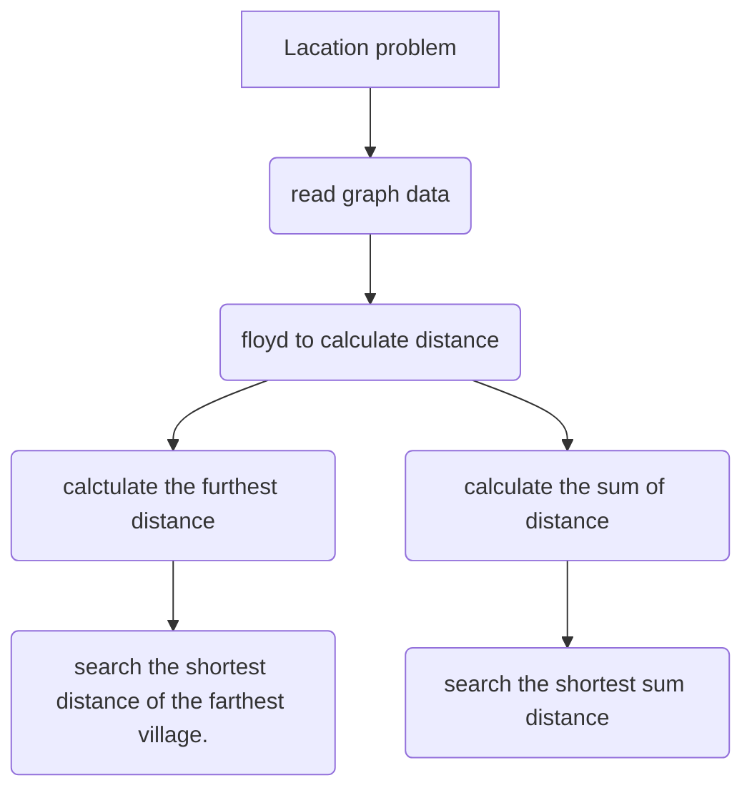

# Graph Comprehensive Experiment Report  

Class: 网络181&emsp;  Student ID 1:18401190120&emsp;Name 1: 曹鹏霄                           
Experiment Date:2019年12月20日


### One、	Experimental purpose
1. Familiar with the basic operation of the graph.
2. Master the storage and travel operation of the graph.
3. Deepen the understanding of the graph algorithms, and to develop the ability to solve practical problems gradually.

### Two、Experimental environment
A computer with visual studio 2019.

This experiment has 4 class hours in all.

### Three、Experimental content

**Location problem**

>**【Basic requirement】**
>
>There is a traffic map of n villages. If there is a road between village i and village j, connect them with an edge and Wij stands for the weight of this edge. Now we plan to choose one village and build a hospital. You are required to write following algorithms:
>
>（1）    Find out the village in which we should build the hospital, making the distance of the farthest village from the hospital is shortest.
>
>   （2）    Find out the village in which we should build the hospital, making the sum distance of all villages to the hospital is shortest. 
>
>**【Tips】**
>
>   For question（1），you can find out the shortest path of every village to all other villages, then store the max value(stands for the distance of the farthest village from hospital if hospital is built in this village); Then find a max value in those min value. 
>
>   For question（2），you can find out the shortest distance of every village to all other villages, then store the sum of all distance(stands for the sum distance of all villages from the hospital); Then find a min value from these sums. 
>
>You can also draw a traffic map of n villages. Here is an example below:
>
>


### Four、Important data structures

__Struct introduce:__

```c
class Graph {
private:
	int dis[N];//distance with i
	priority_queue<int> Q;//get the furthest
	int sum;//sum of distance with other villages
	int furthest;//the furthest distance from other villages
public:
	int tot;//village numbers
};
```
__Function introduce:__

```C
void getData();//read graph data from file
void floyd(int&, int&);//floyd algorithm calculate the distance
void printDistance();//print distance
void init();//initializate tot with i
```

<div STYLE="page-break-after: always;"></div>
### Five、Implementation analysis



##### 1.floyd function

​	Let $d [k, i, j] $denote the shortest path length from $i$ to $j$ through several nodes with no more than $k $. The problem can be divided into two subproblems, one is from $i$ to $j$ through nodes no more than $k-1 $, the other is from $i$ to $k$ and then to $j$ . therefore:
$$
D[k,i,j]=min(D[k-1,i,j],D[k-1,i,k]+D[k-1,k,j])
$$
*code show below.*

```c
void floyd(int &furthestVill, int &allVill) {
	//-----floyd algorithm-----
	for (int k = 0; k < villageN; k++) {
		for (int i = 0; i < villageN; i++) {
			for (int j = 0; j < villageN; j++) {
				graph[i].dis[j] = min(graph[i].dis[j], graph[i].dis[k] + graph[k].dis[j]);
			}
		}
	}
	//---get furthest distance and sum distance --- 
	for (int i = 0; i < villageN; i++) {
		graph[i].dis[i] = 0x3f3f3f3f;
		for (int j = 0; j < villageN; j++) {
			if (i == j || graph[i].dis[j] > 0x3f3f3f)continue;
			graph[i].Q.push(graph[i].dis[j]);//get the furthest distance
			graph[i].sum += graph[i].dis[j];//maintain the sum of distance
		}
		graph[i].furthest = graph[i].Q.top();
		if (graph[furthestVill].furthest > graph[i].furthest)
			furthestVill = i;
		if (graph[allVill].sum > graph[i].sum)
			allVill = i;
	}
}
```


### Six、Debugging problem analysis 

**Bug 1**

> Variable variables are declared in the. H file contained in the header file, resulting in display redefinition errors

**Sovle**

>Move variable variable out and use external variable instead

**Bug 2**

> No extern when using global variables compile errors between multiple files

**Sovle:**

> Add extern to bulid connection in multiple files
>

**Bug 3**

>After sorting, the subscript is regarded as the number of the graph, which makes it disordered
>

**Sovle:** 

> Add tot to the structure as the number of the graph

****

### Seven、	Summary

>&emsp;In graph theory, if there is a path from one vertex to another vertex in a graph without authority, the path length is the number of edges that pass through the path, equal to the tree of vertices on the path minus 1.There may be multiple paths from one vertex to another, and the number of edges on each path may be different, that is, the path length may be different. The path with the shortest path length is called the shortest path, and its path length is called the shortest path length.If the edge is weighted, the edge weights are added for comparison.
		And applying these theories to the actual problem is the minimum cost of building a road or a base station.The real problem is abstracted into edge weights and solved by graph theory.

### Eight、Crew Divison

​																			

​																	

|                 |  **Group divsion**  |                         |
| :--: |:--: | :--: |
| **Member name** |    **work done**    | **Comletion situation** |
| 曹鹏霄 | **Location problem** | 100% |

