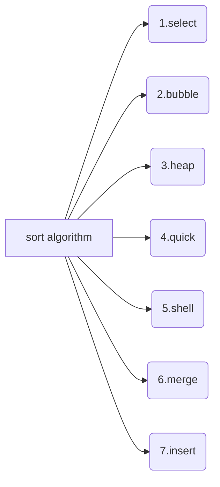

## 			Sort comprehensive experiment Report  

Class: 网络181&emsp;  Student ID 1:18401190120&emsp;Name 1: 曹鹏霄                           
Experiment Date:2019年12月7日


### One、	Experimental purpose
1) Familiar with the basic operations of the sort.

2) Master the operation of various internal sorting.

3) Deepen the understanding of the sort, and to develop the programming ability of solving practical problems gradually.

### Two、Experimental environment
A computer with visual studio 2019.

This experiment has 4 class hours in all.

### Three、Experimental content

>A series of strings are stored in a two-dimensional array. Try to sort them with some sorting algorithms (at least two algorithms, such as insert sorting, bubble sorting, quick sorting, and heap sorting). You should sort them to dictionary order finally.
>
>For example: two-dimensional array is :
>
>char s[][20]={“while”，”if”，“else”，”do”，“for”，”switch”，“case”};

### Four、Important data structures
__Struct introduce:__

```c
class sortClass {
private:
    int rowN;//the number of elements
    char Array[N][20];//elements
};
```
<div STYLE="page-break-after: always;"></div>
__Function introduce:__

```C
int getRow();//return the size of the row of  elements
void getdata();//read data from file
void outdata(const string&);//output data into file
void disArray();//print the elements
void selectSort();//1.select sort algorithm
void bubbleSort();//2.bubble sort algorithm
void heapSort();//3.heap sort algorithm
void quickSort(int, int);//4.quick sort algorithm
void shellSort();//5.shell sort algorithm
void mergeSort();//6.merge sort algorithm
void insertSort();//7.insert sort algorithm
void myCopy(char*, const string&);//copy string from string to char array 
void swapChar(char*, char*);//swap two chars
void randChar(int n);//product n rows rand char
```
### Five、Implementation analysis



<div STYLE="page-break-after: always;"></div>

##### 1.select sort

​	Each time, select the element with the smallest key from the elements to be sorted, and place it at the end of the sorted sub table until all elements are sorted.

```C++
void sortClass::selectSort() {//插入排序
	for (int i = 0; i < rowN; i++) {
		int min = i;
		strcpy(Array[min], Array[i]);
		for (int j = i; j < rowN; j++) {
			if (strcmp(Array[min], Array[j]) > 0)//找到最小的字符串
				min = j;
		}
		char tChar[20];
		//---- 将最小的字符串插入有序数组---
		strcpy(tChar, Array[i]);
		strcpy(Array[i], Array[min]);
		strcpy(Array[min], tChar);
	}
}
```

##### 2.bubble sort

​	Through the comparison of key words and the exchange of positions between adjacent elements in the disordered area, the element with the smallest key words '' floats up '' to the '' surface '' like a bubble

```C++
void sortClass :: bubbleSort() {
	for (int i = 0; i < rowN; i++) {
		for (int j = 0; j < rowN-i; j++) {
			if (strcmp(Array[j], Array[j + 1])  > 0) {
				char tChar[20];
				//----将大的数向后冒泡达到从小到大的排序目的---
				strcpy(tChar, Array[j]);
				strcpy(Array[j], Array[j + 1]);
				strcpy(Array[j + 1], tChar);
			}
		}
	}
}
```

##### 3.heap sort

​	Use a priority queue to Maintenance the key array,then  select the element with the smallest key from the priority queue, and place it at the end of the sorted sub table until all elements are sorted.

~~~c
struct myChar {
	char ele[20];
	myChar(char Ele[]) {
		strcpy(ele, Ele);
	}
};
bool operator>(myChar A, myChar B) {
	if (strcmp(A.ele, B.ele) > 0)
		return true;
	return false;
}
bool operator<(myChar A, myChar B) {
	if (strcmp(A.ele, B.ele) < 0)
		return true;
	return false;
}
void sortClass :: heapSort() {
	priority_queue<myChar> Q;
	for (int i = 0; i < rowN; i++) {
		myChar tChar(Array[i]);
		Q.push(tChar);
	}
	for (int i = 0; i < rowN; i++) {
		strcpy(Array[rowN-i-1], Q.top().ele);
		Q.pop();
	}
}
~~~

##### 4.quick sort

​	In for sorting n elements take an element as a benchmark, put the element in the right place after the data sequences are divided into two parts, each other items all the key word is smaller than the element keyword element placed in the first part, all the key elements of the bigger than it placed in the part, and to arrange the elements in the middle of the two parts, this process is called after a trip to the quick sort of all separate two parts respectively, repeat the above process until each part is only one element or not.

```c
void sortClass :: quickSort(int L, int R) {
	int i = L, j = R;
	char tChar[20];
	if (L < R) {
		strcpy(tChar, Array[i]);//以区间的第一个元素作为基准
		while (i != j) {
			while (j > i&& strcmp(Array[j], tChar) >= 0)
				j--;//找到右边第一个小于基准的串
			strcpy(Array[i], Array[j]);

			while (i < j && strcmp(Array[i], tChar) <= 0)
				i++;//找到左边第一个大于基准的串
			strcpy(Array[j], Array[i]);
		}
		strcpy(Array[i], tChar);
		quickSort(L, i - 1);//向左排序
		quickSort(i + 1, R);//向右排序
	}
}
```

##### 5.shell sort

​	First, take a small and n integer D as the first increment, divide all elements of the table into D groups, put all elements with multiple distance of D in the same group, and sort in each group. Then go to the second increment until all elements are in the same group.

```c
void sortClass::shellSort() {
	int i, j, gap = rowN / 2;
	char tChar[20];
	while (gap > 0) {
		for (int i = gap; i < rowN; i++) {//对所有间隔gap的元素进行插入排序
			strcpy(tChar, Array[i]);
			j = i - gap;
			while (j >= 0 && strcmp(tChar, Array[j]) < 0) {
				strcpy(Array[j + gap], Array[j]);
				j -= gap;
			}
			strcpy(Array[j + gap], tChar);
		}
		gap >>= 1;//除二
	}
}
```

##### 6.merge sort

​	The array to be sorted is regarded as an N-group ordered sequence with an ordered length of 1, and then the two are merged, and then the process is repeated until they are merged into an ordered sequence with a length of n.

```c
void MergePass(char Array[N][20], int length, int n) {
	//----完成一次归并-----
	int i;
	for (i = 0; i + 2 * length <= n; i = i + 2 * length)//0 2 4 6 
		//---将数组分成等长的子表进行一趟归并，多余的元素不做处理--
		Merge(Array, i, i + length - 1, i + 2 * length - 1);
	if (i + length - 1 < n)//将最后一组不等长的元素进行归并
		Merge(Array, i, i + length - 1, n - 1);
}
void sortClass :: mergeSort() {
	for (int length = 1; length < rowN; length *= 2)
		MergePass(Array, length, rowN);
}
```

##### 7.insert sort

​	Each time, insert the elements to be sorted into the proper position in the sorted sub table according to their key size until all elements are inserted.

```c
void sortClass::insertSort() {
	int i, j;
	char tChar[20];
	for (i = 1; i < rowN; i++) {
		strcpy(tChar, Array[i]);
		j = i - 1;
		while (j >= 0 && strcmp(tChar, Array[j]) < 0) {
			strcpy(Array[j + 1], Array[j]);
			j--;
		}
		strcpy(Array[j + 1], tChar);
	}
}
```

<div STYLE="page-break-after: always;"></div>

### Six、Debugging problem analysis 

**Bug 1:**

> Priority queue can run normally with my defined struct.   

**Sovle:**

> Overload greater than sign and less than sign
>

**Bug 2**

> Large amount of data leads to too deep recursion of merge sort

**Sovle**

>Divide the data into small segments and use heap sorting for ordering to prevent too deep recursion

**Bug 3**

>When defining data, the memory application of char 2-digit stack is too large, resulting in crash
>

**Sovle:** 

> Change character length to 20, reduce stack

****

### Seven、	Summary

>&emsp;The amount of sorting algorithm code is not large, but the connotation of the idea is a very delicate exchange method and comparison method, so that the algorithm time complexity of the decline of the ingenious can not be understood in a time.You need to put the actual code to sort the specific data and then call out its internal process, to make your experience more profound.
		In the future, since each language has its own ready-to-use and optimized sorting algorithm library to call, we rarely write sorting algorithms manually.We should take this rare opportunity to appreciate the subtlety of the various sorting algorithms, or actively look for a ready-made sorting algorithm library to see how it optimizes the various sorting algorithms.

### Eight、Crew Divison

​																			

​																	

|                 |  **Group divsion**  |                         |
| :--: |:--: | :--: |
| **Member name** |    **work done**    | **Comletion situation** |
| 曹鹏霄 | Sort comprehensive experiment | 100% |

