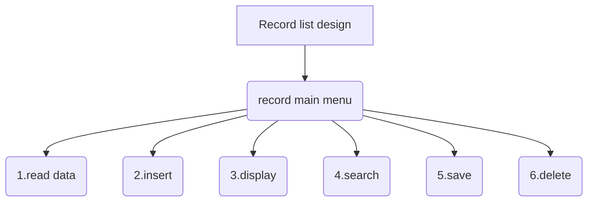

## 			Address List Design Experiment Report  

Class: 网络181&emsp;  Student ID 1:18401190120&emsp;Name 1: 曹鹏霄                           
Experiment Date:2019年9月28日


### One、	Experimental purpose
1.Use the basic operations to implement the specific operations for the linear table;

2.Master the application of file operations;

3.Improve the understanding of the data structure of linked storage structure, and gradually cultivate the programming ability to solve practical problems.

### Two、Experimental environment
A computer with visual studio 2019.

This experiment has 4 class hours in all.

### Three、Experimental content

<font size=4>Design a classmate's address list, requested as follows:</font>

>Each student in the address list contains the following information: 
student id、name、telephone number. If you need more fields, please add them yourself.

>The program has a main menu containing the following functions:

>*（1）Add a record: Add a student record from the input.*
*（2）Delete a record: Delete a student record according to the student id from the input.*
*（3）Output all records: Display all the records in the address list.*
*（4）Search by name: Input the student name and then output the whole information of the student.*
*（5）Save records: Save all the records in the address list to a certain file.*
*（6）Clear records: Delete all the records in the address list and then* 
*delete the file.*
*（7）Quit*

### Four、Important data structures
>__Struct introduce:__

```c
struct Record{
	string tele;//telephone
	string name;//name
	string id;	//numbers
	struct Record *Next;//behind point

	Record() {
		tele = "None";
		name = "None";
		id = "None";
		Next = NULL;
	}
};
```
__Function introduce:__
	

```C
#define Filename "data.txt"

int read_data();			//1.read data from file
int insert_record(Record*);	//2.insert a record to list records
void print_record();		//3.print all list records
Record *search_name();		//4.search a record from list records
void save_to_file();		//5.save list records to file
int del_all();				//6.delete all records and delete file
void print_main_menu();		//7.display main menu data
struct Record * new_re();	//create a struct record

extern Record* head_re;		//head point
const int N = 1e3;			//const constant integer
```
### Five、Implementation analysis



**<font size = 5>using below code to display main menu</font>**

```C++
void print_main_menu() {
	cout << "|---------------Main menu---------------|\n"\
			"| 1.read data from file                 |\n"\
			"| 2.insert a record to record list      |\n"\
			"| 3.print the record list               |\n"\
			"| 4.search record with name             |\n"\
			"| 5.save record list to file            |\n"\
			"| 6.delete all record and delete file   |\n"\
			"| 7.display main menu data              |\n"\
			"|---------------------------------------|\n" << endl;
}
```

**<font size = 5>using below code to implment main menu</font>**

```C++
while (true) {
		cout << "Please enter your operation:";
		//---aviod enter endless loop when cin fail---
		
		try{
			if (!(cin >> choice)) {
				while(getchar() != '\n');//solve the '\n'
				cin.clear();
				choice = 0;
				throw "choice";
			}
			switch(choice){
				case 1:
					read_data();
					break;
				case 2:
					insert_record(new_re());
					break;
				case 3:
					print_record();
					break;
				case 4:
					search_name();
					break;
				case 5:
					save_to_file();
					break;
				case 6:
					del_all();
					break;
			} 
		}
		catch(string &ex){
			cout << ex << " not a operation, Please enter valid number:" << endl;
		}
```


__1.read data__

> using  `fstream in_record(Filename, ios::in)` to read records from file
>
> using `is_open()`to judge have a file  
>
> using `eof()`to judge end of file

__2.insert__

```C++
int insert_record(Record *R1){
	//----头插法----
	R1->Next = head_re->Next;//link head next point
	head_re->Next = R1;//link head point 
	return 0;
}
```

__3.display__

> through record list then cout they

__4.search__

> through record list and compare names ,if common display the record

__5.save__

> using `fstream out_record(Filename, ios::out)` to save record

__6.delete__

```C++
int del_all() {
	//---delete all records and delete the file----
	Record* ptr = NULL;
	for (ptr = head_re->Next; ptr != NULL; ptr = ptr->Next) {
		//----let head point point ptr's Next--- 
		head_re->Next = ptr->Next;
		//----then free the memory-----
		free(ptr);
	}
	//-----delete the file---- 
	remove(Filename);
	return 0;
}
```


>*1．Because address lists are designed with a large amount of code, you should choose multiple files for editing instead of stacking a large number of code in one file.*
*2．you need a menu bar as the main menu to enter the interface. The main menu can do all the operations includingAdd a record， Delete a record:，Output all records，Search by name，Save records，Clear records，Quit.* 
*3．Exit freely when inputting information*
*4．Insertion functions can be used repeatedly in programs, so the functions of insertion functions are designed to be more explicit so that calls can be made using other functions.*
*5．For insert function design, because of the need to sort, it is necessary to store the student number in the form of int or use string library to facilitate comparison. Without considering a large amount of data, here we search the original data sequentially before inserting the student number every time to find the current insertion location for insertion, that is, to point the current node to the latter node. Then point the previous node to the current node.*

### Six、Debugging problem analysis 

**Bug 1:**

> When you enter the main menu for selection, if you enter a choice that is not a digital program, you will enter a dead loop, because typing characters when reading integers in `scanf ("%d")` format will cause reading failure


**Sovle:**

> Add a judgment on `scanf()`reading, prompt the user when the input format is incorrect, and let the choice assign a number of non-menu options to enable it to select again
>
> 

**Bug 2**

> Visual studio is not allowed to use scanf () in security mode

**Sovle**

>Pre-compilation by adding `# define_CRT_SECURE_NO_WARNINGS` ignores the limitation of security mode

**Bug 3**

>Failure to initialize the head declaration to NULL causes errors in judging the insertion function, causing the program to crash.
>
>```C++
>struct student *head, *p;
>```

**Sovle:** 

> initialize head point with NULL

**Bug 4**

>Creat head point by constrcut
>
>
>
>

**Sovle:**

> insead that state of`Record* head_re = (Record*)malloc(sizeof(Record));`

**Bug 5**

> Declare head_re in the file of head.h cause error: mutidefine head_re 

**Slove**

> Using extern to declare External Variable in head.h like:
>
> ```C++
> extern Record * head_re;//state external variable
> ```
>
> Then declare head_re in main.cpp

**Bug 6**

> Consfusing the parameter, instead head point pf ptr point using insert_record(). when read data

**Slove**

> Change the parameter

**Bug 7**

> No initlialize choice cause that program enter endless loop when input error
>
> 

**Solve**

```C++
while(!(cin >> choice) || choice > 7 && choice <= 0) {
				while(getchar() != '\n');//solve the '\n'
				cin.clear();
				choice = 0;
				throw "choice";
			}
```

****

### Seven、	Summary

>&emsp;It is very important for a large project to have a better design concept at the beginning. It is very important to plan the project at the very beginning, and consider where to put those functions to what extent should the project be completed. If time is too late, those functions that are not particularly important should be abandoned. User interface design should be as friendly as possible.
>&emsp;Because of the large amount of code, many functions must be modularized, not all things in a function, we should try to build as many small functions as possible to achieve the corresponding functional blocks. In some very important details, we need to check the overall operation of the code through single-step debugging to see if the address and quantity of all variables go down as we expected.
>&emsp;When we encounter problems, we must actively search instead of blindly trying all kinds of useless things by ourselves. Flexible use of search tools can make us better understand many problems, because what we do on the Internet is sure that other people encounter the same problems. It is very important to actively communicate in the forum.

### Eight、Crew Divison

​																			

​																	

|                 |  **Group divsion**  |                         |
| :--: |:--: | :--: |
| **Member name** |    **work done**    | **Comletion situation** |
| 曹鹏霄 | Address List Design | 100% |

